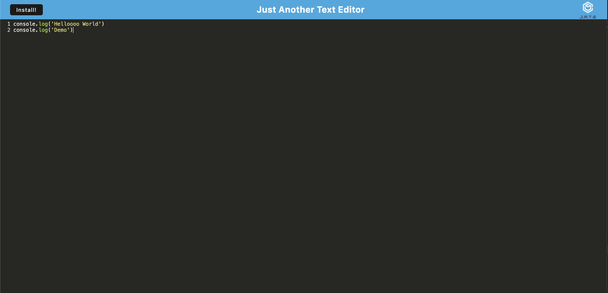

# JATE: Just Another Text Editor

## Description

This application is a Progressive Web Application text editor. The intended purpose of this application is to allow use offline and features a number of data persistence techniques that serve as redundancy in case one of the options is not supported by the browser. The application also optimizes cache storage.

## Installation

To install this application, open it in the browser, and click the install button. Data will persist from the browser window.

## Usage

## Credits

Source code courtesy of bootcamp.
